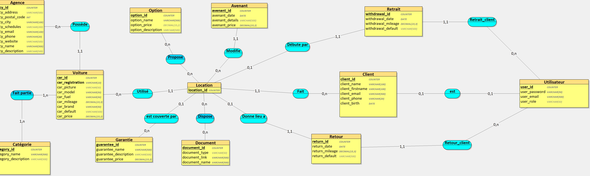
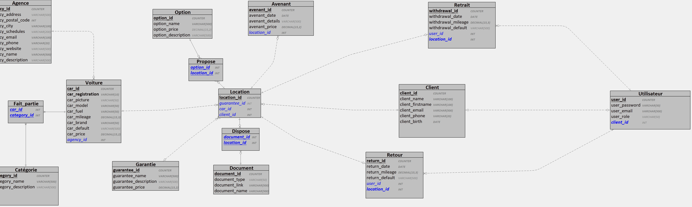

# Site de location de voiture - DriveBy
## Membres du groupe
- Nyl SAUVAL
- Beni TUKALAYENGE MIANTUILA
- Emma GRAVE

## Description
Projet composé de trois parties :
- **Serveur** : API REST (Laravel) - [voir le readme](URL)
- **Client Web** : Interface utilisateur (Angular) - [voir le readme](https://gitlab.univ-artois.fr/but22/s4/s4-a-01/location-de-voitures/-/blob/dev/client/README.md)
- **Mobile** : Application mobile (Angular - Ionic) - [voir le readme](URL)

## 📁 Structure des dossiers

```bash
/
├── client/       # Application web frontend
├── mobile/       # Application mobile
├── server/       # API Laravel backend
└── README.md     # Ce fichier
```

## Lancer tous les projets :
```bash
cd server && php artisan serve
cd ../client && ng serve
cd ../mobile && ionic serve
```

## Système d'information
### MCD

### MLD


